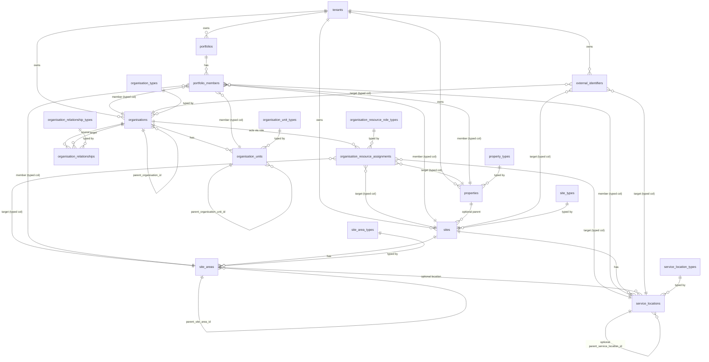

# Module 1A — Global Multi-Tenancy, Organisation & Operating Structure

Status: **DRAFT — PENDING ARCHITECTURE APPROVAL**. This is a design proposal only. No migrations,
tables, or code exist for anything in this document. Do not treat this as implemented — see
`docs/BUILD_STATUS.md` for what actually exists (nothing beyond Module 0A).

## Precondition check (done before writing this document)

- `git log --oneline`: one commit, `chore: scaffold monorepo and configure remote Supabase dev
  environment`. `git status`: clean working tree. Module 0/0A baseline is committed and clean —
  safe to branch from.
- `supabase/migrations/` contains only `.gitkeep` — no migrations exist yet.
- `packages/database-types/src/database.ts` is the tableless generated schema (Module 0A state).
- `supabase/.temp/project-ref` = `tjquptsksqjmvztvfgfp`, matching the DEV/STAGING project
  confirmed in `docs/DECISION_LOG.md`.
- Read `CLAUDE.md`, `PLATFORM_ARCHITECTURE.md`, `SECURITY_MODEL.md`, `CONFIGURATION_MODEL.md`,
  `CHANNEL_REGISTRY.md`, `MODULE_MASTER.md`, `BUILD_STATUS.md`, `DECISION_LOG.md`,
  `DEVELOPMENT_SETUP.md`. **No conflicts found** between this brief and existing architecture —
  the shared-Postgres + `tenant_id` + RLS isolation model, migration-first workflow, and
  "Module 2 owns membership" boundary are all already established and this design follows them.

Recommended branch when work begins: `feature/module-1-global-org-foundation`. Not created here —
no commits or branch changes have been made.

---

## A. Proposed ERD

Notes on cardinality not expressible in Mermaid ER syntax:

- Every self-referencing edge (`organisations`, `organisation_units`, `site_areas`,
  `service_locations`) is optional (0..1 parent) and must resolve to the **same tenant** — enforced
  by composite FK, not just convention (see Section E).
- "Target (typed col)" / "member (typed col)" edges mean: exactly one of several nullable FK
  columns on the child row is populated, enforced by a `CHECK` constraint (see Section D, Option B).
- `properties → sites` is optional in both directions of meaning: a site may have no property, and
  a property need not force any site to exist yet.

---

## B. Exact Proposed Tables

Conventions applied to every table below unless noted: `id uuid primary key default
gen_random_uuid()`, `created_at timestamptz not null default now()`, `updated_at timestamptz not
null default now()` (maintained by a shared `set_updated_at()` trigger). These are omitted from
the column lists to avoid repetition.

### `tenants`

Purpose: the SaaS security/data-isolation/commercial realm. Not assumed to equal a company.

| Column | Type | Null | Default | Notes |
|---|---|---|---|---|
| slug | text | not null | — | globally unique, URL/identifier-safe |
| name | text | not null | — | display name |
| default_locale | text | null | — | BCP 47, e.g. `en-IN` |
| default_currency_code | char(3) | null | — | ISO 4217 |
| default_timezone | text | null | — | IANA, e.g. `Asia/Kolkata` |
| lifecycle_status | text | not null | `'active'` | CHECK IN (draft, active, inactive, suspended, archived) |

Unique: `(slug)`. Also expose `UNIQUE (id)` implicitly via PK — required as the composite-FK target
for every child table's `tenant_id` column (see Section E).
Indexes: unique index on `slug` (also serves lookups); btree on `lifecycle_status`.

### `organisation_types` / `organisation_unit_types` / `organisation_relationship_types` /
### `organisation_resource_role_types` / `property_types` / `site_types` / `site_area_types` /
### `service_location_types`

Purpose: platform-controlled, tenant-immutable reference registries (see Section C). All eight
share one shape:

| Column | Type | Null | Default | Notes |
|---|---|---|---|---|
| code | text | not null | — | unique, upper_snake_case, immutable business key |
| name | text | not null | — | display label |
| description | text | null | — | |
| is_active | boolean | not null | `true` | inactive codes stay for historical FK integrity, hidden from new-record pickers |
| sort_order | integer | not null | `0` | display ordering only |

Unique: `(code)`. Index: `(is_active)`. No `tenant_id` — global platform data.

### `organisations`

Purpose: a real-world organisation/legal/business entity or institution, tenant-scoped.

| Column | Type | Null | Default | Notes |
|---|---|---|---|---|
| tenant_id | uuid | not null | — | FK → `tenants(id)`; also exposes `UNIQUE (tenant_id, id)` |
| organisation_type_id | uuid | not null | — | FK → `organisation_types(id)` |
| parent_organisation_id | uuid | null | — | composite FK `(tenant_id, parent_organisation_id)` → `organisations(tenant_id, id)` |
| code | text | not null | — | unique within tenant |
| name | text | not null | — | |
| country_of_registration_code | char(2) | null | — | ISO 3166-1 alpha-2, informational only |
| lifecycle_status | text | not null | `'active'` | CHECK IN (draft, active, inactive, suspended, archived) |

Unique: `(tenant_id, code)`, `(tenant_id, id)` (FK-support). CHECK: `id <> parent_organisation_id`.
Indexes: `(tenant_id)`, `(parent_organisation_id)`.
FK delete behavior: `tenant_id` → RESTRICT; `parent_organisation_id` → RESTRICT (no cascading
detach of a hierarchy; archive instead of delete).

### `organisation_units`

Purpose: flexible, recursive internal hierarchy inside a single `organisation` (business unit,
division, region, department, etc.) — no fixed levels.

| Column | Type | Null | Default | Notes |
|---|---|---|---|---|
| tenant_id | uuid | not null | — | FK → `tenants(id)` |
| organisation_id | uuid | not null | — | composite FK `(tenant_id, organisation_id)` → `organisations(tenant_id, id)`; a unit never moves between organisations |
| organisation_unit_type_id | uuid | not null | — | FK → `organisation_unit_types(id)` |
| parent_organisation_unit_id | uuid | null | — | composite FK `(tenant_id, organisation_id, parent_organisation_unit_id)` → `organisation_units(tenant_id, organisation_id, id)` — guarantees parent is same tenant **and** same organisation |
| code | text | not null | — | unique within organisation |
| name | text | not null | — | |
| lifecycle_status | text | not null | `'active'` | same CHECK set as above |

Unique: `(organisation_id, code)`, `(tenant_id, organisation_id, id)` (FK-support — the only
FK-support unique this table exposes; junction tables that target an organisation unit carry their
own `organisation_id` context column rather than this table also exposing a bare `(tenant_id,
id)` — decision recorded in Section L). CHECK: `id <> parent_organisation_unit_id`.
Indexes: `(tenant_id)`, `(organisation_id)`, `(parent_organisation_unit_id)`.

### `organisation_relationships`

Purpose: time-bound relationships between two independent organisations (CLIENT,
SERVICE_PROVIDER, LANDLORD, VENDOR, …). Never overwritten — a changed relationship ends the old
row (`effective_until`) and inserts a new one.

| Column | Type | Null | Default | Notes |
|---|---|---|---|---|
| tenant_id | uuid | not null | — | FK → `tenants(id)` |
| source_organisation_id | uuid | not null | — | composite FK `(tenant_id, source_organisation_id)` → `organisations(tenant_id, id)` |
| target_organisation_id | uuid | not null | — | composite FK `(tenant_id, target_organisation_id)` → `organisations(tenant_id, id)` |
| relationship_type_id | uuid | not null | — | FK → `organisation_relationship_types(id)` |
| effective_from | date | not null | `current_date` | |
| effective_until | date | null | — | open-ended if null |
| status | text | not null | `'active'` | CHECK IN (active, ended, cancelled) — distinguishes "ran its course" from "terminated early/superseded" independent of the date range |

Unique: none forcing single-active-pair — see risk note in Section L (type-specific exclusivity is
a policy concern, not a schema one, in Module 1). CHECK: `source_organisation_id <>
target_organisation_id`; `effective_until IS NULL OR effective_until >= effective_from`.
Indexes: `(tenant_id)`, `(source_organisation_id)`, `(target_organisation_id)`,
`(relationship_type_id)`, partial index `(source_organisation_id, target_organisation_id) WHERE
effective_until IS NULL` (fast "what's currently active" lookups).

### `portfolios`

Purpose: logical management grouping independent of organisation or geography.

| Column | Type | Null | Default | Notes |
|---|---|---|---|---|
| tenant_id | uuid | not null | — | FK → `tenants(id)` |
| code | text | not null | — | unique within tenant |
| name | text | not null | — | |
| description | text | null | — | |
| lifecycle_status | text | not null | `'active'` | same CHECK set |

Unique: `(tenant_id, code)`, `(tenant_id, id)` (FK-support). Index: `(tenant_id)`.
No `portfolio_types` registry — see Section C rationale.

### `portfolio_members`

Purpose: membership of a portfolio, targeting exactly one resource of any scopable type (typed
column pattern — Section D, Option B).

| Column | Type | Null | Default | Notes |
|---|---|---|---|---|
| tenant_id | uuid | not null | — | FK → `tenants(id)` |
| portfolio_id | uuid | not null | — | composite FK `(tenant_id, portfolio_id)` → `portfolios(tenant_id, id)` |
| organisation_id | uuid | null | — | composite FK → `organisations(tenant_id, id)` |
| organisation_unit_id | uuid | null | — | composite FK, together with the context column below |
| organisation_unit_organisation_id | uuid | null | — | context column: the `organisation_id` that owns `organisation_unit_id`; composite FK `(tenant_id, organisation_unit_organisation_id, organisation_unit_id)` → `organisation_units(tenant_id, organisation_id, id)`; populated only when `organisation_unit_id` is set |
| property_id | uuid | null | — | composite FK → `properties(tenant_id, id)` |
| site_id | uuid | null | — | composite FK → `sites(tenant_id, id)` |
| site_area_id | uuid | null | — | composite FK, together with the context column below |
| site_area_site_id | uuid | null | — | context column: the `site_id` that owns `site_area_id`; composite FK `(tenant_id, site_area_site_id, site_area_id)` → `site_areas(tenant_id, site_id, id)`; populated only when `site_area_id` is set |
| service_location_id | uuid | null | — | composite FK, together with the context column below |
| service_location_site_id | uuid | null | — | context column: the `site_id` that owns `service_location_id`; composite FK `(tenant_id, service_location_site_id, service_location_id)` → `service_locations(tenant_id, site_id, id)`; populated only when `service_location_id` is set |
| effective_from | timestamptz | not null | `now()` | |
| effective_until | timestamptz | null | — | |

Context columns exist because `organisation_units`, `site_areas`, and `service_locations` each
require their *parent* (organisation/site) as part of a tenant-safe composite FK, and that parent
type is itself one of this table's other possible targets (`organisation_id`, `site_id`) — so the
context can't just reuse the same column without colliding with "this row targets that parent
directly" (decision recorded in Section L, option chosen over giving these three hierarchy tables
an extra bare `(tenant_id, id)` unique). The context column is a nice side effect, not just
bookkeeping: because it participates in the composite FK, Postgres itself rejects a row where the
supplied context doesn't match the referenced row's real parent — it can't silently drift.

CHECK: exactly one of `organisation_id`, `organisation_unit_id`, `property_id`, `site_id`,
`site_area_id`, `service_location_id` is non-null (`num_nonnulls(...) = 1`). CHECK: each context
column's nullability matches its target's — `(organisation_unit_id IS NULL) = (organisation_unit_organisation_id
IS NULL)`, `(site_area_id IS NULL) = (site_area_site_id IS NULL)`, `(service_location_id IS NULL)
= (service_location_site_id IS NULL)`. CHECK: `effective_until IS NULL OR effective_until >=
effective_from`.
Unique (prevents duplicate active membership): partial unique index on
`(portfolio_id, coalesce(organisation_id,...), ...) WHERE effective_until IS NULL` — in practice
implemented as one partial unique index per target column (six narrow indexes, each `WHERE
<column> IS NOT NULL AND effective_until IS NULL`), which is simpler and more efficient than a
single expression index over six coalesced columns.
Indexes: `(tenant_id)`, `(portfolio_id)`, one per target column (`WHERE <column> IS NOT NULL`).

### `properties`

Purpose: optional estate/building ownership layer above Site.

| Column | Type | Null | Default | Notes |
|---|---|---|---|---|
| tenant_id | uuid | not null | — | FK → `tenants(id)` |
| property_type_id | uuid | not null | — | FK → `property_types(id)` |
| code | text | not null | — | unique within tenant |
| name | text | not null | — | |
| address_line_1 | text | null | — | see Section G |
| address_line_2 | text | null | — | |
| locality | text | null | — | |
| administrative_area | text | null | — | state/province/emirate, free text |
| postal_code | text | null | — | |
| country_code | char(2) | null | — | ISO 3166-1 alpha-2, CHECK format |
| latitude | numeric(9,6) | null | — | |
| longitude | numeric(9,6) | null | — | |
| lifecycle_status | text | not null | `'active'` | same CHECK set |

Unique: `(tenant_id, code)`, `(tenant_id, id)` (FK-support). Index: `(tenant_id)`.

### `sites`

Purpose: operational physical/virtual/hybrid location — the primary structural unit later
capabilities attach to.

| Column | Type | Null | Default | Notes |
|---|---|---|---|---|
| tenant_id | uuid | not null | — | FK → `tenants(id)` |
| property_id | uuid | null | — | composite FK `(tenant_id, property_id)` → `properties(tenant_id, id)`; optional per spec |
| site_type_id | uuid | not null | — | FK → `site_types(id)` |
| mode | text | not null | `'physical'` | CHECK IN (physical, virtual, hybrid) — stable trichotomy, not a registry (see Section C) |
| code | text | not null | — | unique within tenant |
| name | text | not null | — | |
| address_line_1 | text | null | — | null for virtual sites |
| address_line_2 | text | null | — | |
| locality | text | null | — | |
| administrative_area | text | null | — | |
| postal_code | text | null | — | |
| country_code | char(2) | null | — | ISO 3166-1 alpha-2 |
| latitude | numeric(9,6) | null | — | |
| longitude | numeric(9,6) | null | — | |
| timezone | text | not null | — | IANA; required even for virtual sites (business-date cutoffs still need one) |
| currency_code | char(3) | null | — | ISO 4217; falls back to `tenants.default_currency_code` in application logic if null |
| locale | text | null | — | BCP 47; falls back to `tenants.default_locale` if null |
| lifecycle_status | text | not null | `'active'` | same CHECK set |

Unique: `(tenant_id, code)`, `(tenant_id, id)` (FK-support). CHECK: `mode <> 'virtual' OR
(address_line_1 IS NULL AND country_code IS NULL AND latitude IS NULL AND longitude IS NULL)` —
prevents a nonsensical physical address on a declared-virtual site (loose, not over-strict: it
does not forbid a physical/hybrid site from *lacking* an address, since not every physical site
needs full geocoding on day one).
Indexes: `(tenant_id)`, `(property_id)`, `(tenant_id, lifecycle_status)` (hot path: "active sites
for tenant").

### `site_areas`

Purpose: recursive physical/operational subdivision of a site (building → floor → zone, etc.).

| Column | Type | Null | Default | Notes |
|---|---|---|---|---|
| tenant_id | uuid | not null | — | FK → `tenants(id)` |
| site_id | uuid | not null | — | composite FK `(tenant_id, site_id)` → `sites(tenant_id, id)`; an area never moves between sites |
| site_area_type_id | uuid | not null | — | FK → `site_area_types(id)` |
| parent_site_area_id | uuid | null | — | composite FK `(tenant_id, site_id, parent_site_area_id)` → `site_areas(tenant_id, site_id, id)` — guarantees same tenant **and** same site |
| code | text | not null | — | unique within site (Section: Stable IDs) |
| name | text | not null | — | |
| lifecycle_status | text | not null | `'active'` | same CHECK set |

Unique: `(site_id, code)`, `(tenant_id, site_id, id)` (FK-support — the only FK-support unique
this table exposes; junction tables that target a site area carry their own `site_id` context
column — decision recorded in Section L). CHECK: `id <> parent_site_area_id`.
Indexes: `(tenant_id)`, `(site_id)`, `(parent_site_area_id)`.
Cycle prevention: trigger — see Section F.

### `service_locations`

Purpose: where a service is produced/delivered/ordered/consumed (cafeteria, kitchen, kiosk, …).

| Column | Type | Null | Default | Notes |
|---|---|---|---|---|
| tenant_id | uuid | not null | — | FK → `tenants(id)` |
| site_id | uuid | not null | — | composite FK `(tenant_id, site_id)` → `sites(tenant_id, id)` |
| site_area_id | uuid | null | — | composite FK `(tenant_id, site_id, site_area_id)` → `site_areas(tenant_id, site_id, id)` — optional, and when present must belong to the *same* site |
| parent_service_location_id | uuid | null | — | composite FK `(tenant_id, site_id, parent_service_location_id)` → `service_locations(tenant_id, site_id, id)` |
| service_location_type_id | uuid | not null | — | FK → `service_location_types(id)` |
| code | text | not null | — | unique within site |
| name | text | not null | — | |
| is_consumer_facing | boolean | not null | `true` | explicit flag — do not assume (spec requirement) |
| lifecycle_status | text | not null | `'active'` | same CHECK set |

Unique: `(site_id, code)`, `(tenant_id, site_id, id)` (FK-support — the only FK-support unique
this table exposes; junction tables that target a service location carry their own `site_id`
context column — decision recorded in Section L). CHECK: `id <> parent_service_location_id`.
Indexes: `(tenant_id)`, `(site_id)`, `(site_area_id)`, `(parent_service_location_id)`.
Cycle prevention: trigger — see Section F.

### `organisation_resource_assignments`

Purpose: "Organisation X plays role R over resource Y" — OWNS/MANAGES/OCCUPIES/LEASES/
OPERATES/SERVES/MAINTAINS/SUPPLIES, targeting Property, Site, Site Area, or Service Location
(typed column pattern).

| Column | Type | Null | Default | Notes |
|---|---|---|---|---|
| tenant_id | uuid | not null | — | FK → `tenants(id)` |
| organisation_id | uuid | not null | — | composite FK → `organisations(tenant_id, id)` |
| role_type_id | uuid | not null | — | FK → `organisation_resource_role_types(id)` |
| property_id | uuid | null | — | composite FK → `properties(tenant_id, id)` |
| site_id | uuid | null | — | composite FK → `sites(tenant_id, id)` |
| site_area_id | uuid | null | — | composite FK, together with the context column below |
| site_area_site_id | uuid | null | — | context column: the `site_id` that owns `site_area_id`; composite FK `(tenant_id, site_area_site_id, site_area_id)` → `site_areas(tenant_id, site_id, id)`; populated only when `site_area_id` is set |
| service_location_id | uuid | null | — | composite FK, together with the context column below |
| service_location_site_id | uuid | null | — | context column: the `site_id` that owns `service_location_id`; composite FK `(tenant_id, service_location_site_id, service_location_id)` → `service_locations(tenant_id, site_id, id)`; populated only when `service_location_id` is set |
| effective_from | timestamptz | not null | `now()` | see rationale below — `timestamptz`, not `date` |
| effective_until | timestamptz | null | — | |
| status | text | not null | `'active'` | CHECK IN (active, ended, cancelled) |

`effective_from`/`effective_until` are `timestamptz` here (unlike `organisation_relationships`,
which uses `date` — see Section J) because every target of this table (property/site/site
area/service location) is anchored to a specific site with a real `timezone`; a plain `date`
would be ambiguous across a globally distributed estate (the same calendar date means a different
absolute instant in `Asia/Kolkata` vs. `America/New_York`). Storing an explicit instant removes
that ambiguity.

CHECK: exactly one of `property_id`, `site_id`, `site_area_id`, `service_location_id` is
non-null. CHECK: context-column nullability matches its target's (same pattern as
`portfolio_members`). CHECK: `effective_until IS NULL OR effective_until >= effective_from`.
Indexes: `(tenant_id)`, `(organisation_id)`, `(role_type_id)`, one per target column (`WHERE
<column> IS NOT NULL`), partial index per target column `WHERE effective_until IS NULL` (current
assignments).

### `external_identifiers`

Purpose: generic extension point for identifiers owned by external systems (SAP, Workday, HRMS,
access-control, vendor systems), without polluting structural tables with per-integration columns.

| Column | Type | Null | Default | Notes |
|---|---|---|---|---|
| tenant_id | uuid | not null | — | FK → `tenants(id)` |
| organisation_id | uuid | null | — | composite FK → `organisations(tenant_id, id)` |
| organisation_unit_id | uuid | null | — | composite FK, together with the context column below |
| organisation_unit_organisation_id | uuid | null | — | context column: the `organisation_id` that owns `organisation_unit_id`; composite FK `(tenant_id, organisation_unit_organisation_id, organisation_unit_id)` → `organisation_units(tenant_id, organisation_id, id)`; populated only when `organisation_unit_id` is set |
| portfolio_id | uuid | null | — | composite FK → `portfolios(tenant_id, id)` |
| property_id | uuid | null | — | composite FK → `properties(tenant_id, id)` |
| site_id | uuid | null | — | composite FK → `sites(tenant_id, id)` |
| site_area_id | uuid | null | — | composite FK, together with the context column below |
| site_area_site_id | uuid | null | — | context column: the `site_id` that owns `site_area_id`; composite FK `(tenant_id, site_area_site_id, site_area_id)` → `site_areas(tenant_id, site_id, id)`; populated only when `site_area_id` is set |
| service_location_id | uuid | null | — | composite FK, together with the context column below |
| service_location_site_id | uuid | null | — | context column: the `site_id` that owns `service_location_id`; composite FK `(tenant_id, service_location_site_id, service_location_id)` → `service_locations(tenant_id, site_id, id)`; populated only when `service_location_id` is set |
| source_system | text | not null | — | free text (e.g. `SAP`, `WORKDAY`) — integration metadata, not architectural semantics, so not a registry |
| external_type | text | not null | — | free text (e.g. `LOCATION_ID`, `COST_CENTRE`) |
| external_value | text | not null | — | |
| is_primary | boolean | not null | `false` | marks the canonical identifier when a target has more than one for the same system/type |

CHECK: exactly one of `organisation_id`, `organisation_unit_id`, `portfolio_id`, `property_id`,
`site_id`, `site_area_id`, `service_location_id` is non-null. CHECK: context-column nullability
matches its target's (same pattern as `portfolio_members`).
Unique: **implemented as one partial unique index per target column** — `UNIQUE (tenant_id,
source_system, external_type, <target_column>) WHERE <target_column> IS NOT NULL`, one per each
of the 7 target columns — **not** a single wide `UNIQUE` constraint across all 10 columns as
originally proposed here. **Correction found during Module 1B testing:** a single composite
`UNIQUE` constraint spanning several nullable columns does not work as this document originally
claimed — Postgres treats `NULL` as distinct from `NULL` by default, so with six of the seven
target columns always `NULL` on any given row (only one target is ever set), no two rows could
ever be judged equal on those always-null columns, and the constraint silently never fired. This
was caught by `scripts/verify-module-1-schema.sql` (a duplicate insert succeeded when it should
have been rejected) and fixed in migration `20260825141400_fix_external_identifiers_uniqueness.sql`
using the same per-target partial-index pattern already proven correct in `portfolio_members`,
where each index only ever covers rows whose one relevant column is non-null. See Section L.
Indexes: `(tenant_id)`, one per target column (`WHERE <column> IS NOT NULL`) — now doing double
duty as both the lookup index and (with the extra columns) the uniqueness index.

---

## C. Reference Type Registries

| Table | Initial codes | Why a registry, not an enum |
|---|---|---|
| `organisation_types` | GROUP, OPERATING_COMPANY, SUBSIDIARY, CORPORATE_CLIENT, FOOD_SERVICE_PROVIDER, PROPERTY_OWNER, PROPERTY_MANAGER, RETAILER, FRANCHISE_OPERATOR, HOSPITAL, UNIVERSITY, SCHOOL, MALL_OPERATOR, GOVERNMENT_ENTITY, OTHER | Global industry coverage will keep growing (new verticals); a Postgres enum requires a migration + type-rewrite risk per addition, a registry is an INSERT |
| `organisation_unit_types` | BUSINESS_UNIT, DIVISION, REGION, COUNTRY_OPERATION, DEPARTMENT, BRAND_DIVISION, CLIENT_ACCOUNT, OPERATING_DIVISION | Every client organises internally differently; this list is expected to be extended per engagement, not fixed by the platform |
| `organisation_relationship_types` | CLIENT, SERVICE_PROVIDER, PROPERTY_OWNER, PROPERTY_MANAGER, OPERATOR, OCCUPANT, RETAILER, VENDOR, LANDLORD, FACILITY_OPERATOR, KITCHEN_OPERATOR, LOGISTICS_PROVIDER | New commercial relationship shapes will appear as new verticals/scenarios onboard |
| `organisation_resource_role_types` | OWNS, MANAGES, OCCUPIES, LEASES, OPERATES, SERVES, MAINTAINS, SUPPLIES | Same reasoning; also lets future policy attach permissions per role code without schema change |
| `property_types` | OFFICE_PARK, COMMERCIAL_BUILDING, MALL, CAMPUS_ESTATE, AIRPORT_ESTATE, MIXED_USE | Estate categories vary by market/vertical |
| `site_types` | CORPORATE_CAMPUS, MANUFACTURING_PLANT, HOSPITAL, UNIVERSITY_CAMPUS, SCHOOL_CAMPUS, MALL, PORT_TERMINAL, WAREHOUSE, AIRPORT_TERMINAL, CENTRAL_PRODUCTION_FACILITY, VIRTUAL_SITE | Core to "no industry-specific schema forks" — new verticals add a row, not a table |
| `site_area_types` | BUILDING, TOWER, BLOCK, FLOOR, WING, ZONE, WARD, HOSTEL, TERMINAL, PRODUCTION_BLOCK, OFFICE_BLOCK, COMMON_AREA | Physical subdivision vocabulary differs radically by vertical (ward vs. floor vs. terminal) |
| `service_location_types` | CAFETERIA, CANTEEN, MESS, FOOD_COURT, RESTAURANT, RETAIL_OUTLET, COFFEE_SHOP, PANTRY, KITCHEN, CENTRAL_KITCHEN, SATELLITE_KITCHEN, PICKUP_POINT, KIOSK, VENDING_ZONE, CONCESSION, SNACK_POINT | Directly product-facing vocabulary; will grow as new formats launch |

**Not created as registries:**

- `lifecycle_status` — cross-cutting, small (5 values), stable platform concept shared by every
  structural table; a `CHECK` constraint is cheaper than a join and there's no tenant-specific
  variation to support.
- `mode` on `sites` (physical/virtual/hybrid) — a stable trichotomy fundamental to how the row
  itself behaves (drives the address CHECK), not an open business taxonomy.
- `portfolio_types` — not created. A portfolio is a free-form, user-named management grouping;
  nothing in the brief's examples ("All India Offices", "2027 Rollout Wave 1") implies the
  *platform* needs to know a fixed taxonomy of portfolio kinds. Revisit only if a real capability
  needs to branch behavior by portfolio type.

Registries are platform data: no `tenant_id`, written only by platform migrations/service-role
tooling, never by tenant-facing API surfaces (see Section E RLS posture).

---

## D. Scope Model Recommendation

Future modules must target configuration/access/branding/policy at Tenant, Organisation,
Organisation Unit, Portfolio, Property, Site, Site Area, or Service Location.

**Option A — generic resource/scope registry.** A central shadow table (e.g. `scope_targets(id,
tenant_id, scope_type, resource_id)`) populated in lockstep (via trigger) with every scopable
entity, so every future feature table carries one `scope_target_id` FK. *Pros:* one FK shape
everywhere, real referential integrity via the shadow row. *Cons:* every insert/delete on a
scopable entity requires a synchronized trigger elsewhere; every feature query needs an extra
join through the shadow table; RLS policies on feature tables can't filter directly by the real
entity's own tenant/hierarchy columns, they must resolve through the shadow table first, adding
policy-evaluation overhead per row; Supabase's generated TypeScript types would represent
`scope_type` as a bare string with no correlated type-safety to `resource_id`.

**Option B — typed target columns with CHECK constraints.** A nullable FK column per resource
type on the table that needs to be scoped, with `CHECK (num_nonnulls(...) = 1)`. *Pros:* real,
native Postgres FK integrity per type (no trigger needed beyond what cross-tenant safety already
requires — see Section E); RLS can `USING` clause directly against whichever column is populated
and its real FK target; query planning is a normal indexed join; Supabase type generation produces
fully-typed nullable columns per resource, which map cleanly to a discriminated union in
TypeScript. *Cons:* every table that needs scoping carries N nullable columns (N = number of
scopable types, currently 6-8); adding a new scopable type later means an `ALTER TABLE ADD
COLUMN` + CHECK update on every scope-consuming table, not one registry insert; cross-scope-type
queries ("everything targeting this exact resource, whatever the scope type") require checking N
columns rather than one.

**Option C — application-level abstraction, bespoke per-feature tables.** Each feature builds its
own real tables per type it cares about (e.g. `configuration_site_values`,
`configuration_tenant_values`, …), with no shared runtime table at all — commonality lives only in
a shared repository/query-builder pattern in application code. *Pros:* maximum referential
integrity and query performance (always a plain, single FK, no CHECK/typed-column indirection);
simplest possible RLS per table. *Cons:* combinatorial table growth (features × scope types) with
nothing enforcing consistency between features unless the application-layer generator is
disciplined; harder to answer "what is scoped to this site across every feature" without querying
every feature table.

**Recommendation: Option B**, used as a **repeatable schema pattern** applied independently by
each scope-consuming table (Module 1's own `portfolio_members`, `organisation_resource_assignments`
and `external_identifiers` already use it), rather than one central polymorphic table (Option A)
or ungoverned bespoke schemas (Option C). Rationale against the requested axes:

- **Referential integrity:** best of the three — real per-type FK, no synchronization trigger risk.
- **RLS complexity:** lowest — policies read the table's own columns directly.
- **Query performance:** best — no extra join hop through a shadow table.
- **Developer ergonomics / TypeScript generation:** each scope-consuming table gets fully typed
  nullable columns; Supabase's generator handles this natively (it does not handle Option A's
  polymorphic `resource_id: uuid` meaningfully at all).
- **Migration complexity:** worse than A when a *new scope type* is introduced (N tables need an
  `ALTER`), but Module 1's scope set (8 types) is expected to be stable; this cost is paid rarely,
  while A's join/RLS/type cost is paid on every query, forever.
- **Long-term maintainability:** Option B repeated consistently *is* the shared pattern — future
  modules (config, access, branding, NFC policy, reporting) each add their own typed-column table
  following the exact shape already established here, rather than inventing per-feature ad hoc
  designs (which is what plain Option C without a shared pattern would produce).

This is a pattern to apply, not a table to build once — no shared "ScopeRef" table exists or should
exist. Do not implement any future module's scope-consuming tables in Module 1; this section only
fixes the pattern they should follow.

---

## E. Tenant Isolation Design

**Ownership:** `tenant_id` is denormalized directly onto every tenant-owned table (organisations,
organisation_units, organisation_relationships, portfolios, portfolio_members, properties, sites,
site_areas, service_locations, organisation_resource_assignments, external_identifiers) rather
than derived by walking a hierarchy at query time. Rationale requested by the brief and confirmed
here: it lets every RLS policy and every index be a direct, un-joined `tenant_id = ...` check —
critical once Module 2 adds `auth.uid() → membership → tenant_id` resolution, and critical for
query performance at the stated future scale (tens of thousands of sites, hundreds of thousands
of service locations).

**Cross-tenant FK protection — composite foreign keys, not triggers.** Every parent table exposes
`UNIQUE (tenant_id, id)` in addition to its primary key. Every child table's FK to a parent then
becomes a **composite FK**: `FOREIGN KEY (tenant_id, parent_id) REFERENCES parent_table(tenant_id,
id)`. This makes a cross-tenant reference a **constraint violation at the database level**, for
free, with no trigger: it is structurally impossible to insert a `site_areas` row whose `site_id`
belongs to a different tenant than the row's own `tenant_id`, because the FK simply won't match.
This same mechanism also makes self-referencing hierarchy FKs (e.g.
`organisations.parent_organisation_id`) automatically same-tenant, and — for
`organisation_units` and `site_areas`/`service_locations` — automatically same-organisation /
same-site respectively, by including that extra column in the composite key (see Section B tables).
Composite FKs are chosen over per-row triggers for this specific problem because they are
declarative, cannot be bypassed by any write path (including future direct-SQL admin tooling), and
impose no runtime overhead beyond a normal FK check Postgres already does.

**Future membership integration (Module 2):** Module 1 does not create any membership/role table.
The only write path to these tables during Module 1 is the Platform API using the Supabase secret
key (service role), which bypasses RLS entirely — this is intentional and matches
`SECURITY_MODEL.md`'s "privileged server operations remain server-only." Module 2 will add
`auth.uid() → profile → membership → tenant_id/site_id/...` and only then add RLS *policies*
(not schema changes to Module 1's tables) that let `authenticated` users read/write rows their
membership entitles them to.

**RLS posture for Module 1 (final for this module, not a placeholder):**

- `ALTER TABLE ... ENABLE ROW LEVEL SECURITY;` on every tenant-owned table listed above.
- **Zero policies** are created for `anon` or `authenticated` roles on any tenant-owned table.
  Enabling RLS with no matching policy is default-deny in Postgres — this alone satisfies "
  anonymous users cannot access tenant records" and "authenticated users with no membership cannot
  access tenant records," because there is no membership concept yet for a policy to key off, and
  none should be invented early.
- `service_role` bypasses RLS by Postgres/Supabase role attribute (`BYPASSRLS`), not by a policy —
  so the Platform API (server-only, secret key) remains fully functional while every other caller
  is locked out.
- Reference registries (`organisation_types`, etc.) get RLS enabled with **one SELECT policy**
  (`USING (true)`) for `anon` and `authenticated` — they are non-sensitive platform metadata that
  the API/UI will need to read to render pickers even before Module 2 exists — and **no**
  INSERT/UPDATE/DELETE policy for those roles (write-locked to service_role, matching "tenants must
  not redefine architectural semantics").
- No table in Module 1 needs `FORCE ROW LEVEL SECURITY` — the API never connects as the table
  owner, so the owner-bypass edge case `FORCE` guards against doesn't apply here.

---

## F. Hierarchy Integrity Design

Composite FKs (Section E) already guarantee a parent reference stays within the same tenant (and,
where relevant, the same organisation/site). They **cannot** prevent a cycle (A→B→A), because a
cycle is a property of the whole graph, not a single row's FK target.

**Chosen mechanism: `BEFORE INSERT OR UPDATE` trigger running a recursive CTE**, applied to the
four self-referencing hierarchy columns: `organisations.parent_organisation_id`,
`organisation_units.parent_organisation_unit_id`, `site_areas.parent_site_area_id`,
`service_locations.parent_service_location_id`. On any insert/update that sets a parent pointer,
the trigger walks *up* from the proposed parent (recursive CTE following `parent_x_id`) and raises
an exception if it ever reaches the row's own `id`. A cheap first line of defense,
`CHECK (id <> parent_x_id)`, catches the trivial self-parent case without needing the trigger at
all.

Why a trigger over the alternatives:

- **Plain CHECK constraint:** impossible — a CHECK can only see the current row, not ancestors.
- **Materialized path / `ltree` column:** would also solve this (and speeds up "all descendants of
  X" queries), but requires maintaining a denormalized path on every hierarchy write and
  re-writing every descendant's path when a subtree is reparented. None of Module 1's stated query
  needs require fast arbitrary-depth descendant queries yet (`WHERE parent_id = X`-style
  single-level traversal, satisfied by the plain btree index on the parent column, is sufficient
  for what's specified). Deferred as a future optimization if hierarchy depth/breadth makes it
  necessary — not built speculatively now.
- **Closure table:** solves the same problem with an explicit ancestor-descendant row per pair,
  at the cost of a second table per hierarchy that must stay in sync on every insert/reparent.
  Same "not justified by a current query need" reasoning applies.

The recursive-CTE trigger is the minimum mechanism that correctly satisfies the actual
requirement ("cycles must be impossible") without pre-building infrastructure for a traversal
performance problem that doesn't exist yet.

---

## G. Global Standards

| Concept | Standard | Where it lives |
|---|---|---|
| Country | ISO 3166-1 alpha-2 (`char(2)`) | `organisations.country_of_registration_code` (informational), `properties`/`sites` address fields |
| Currency | ISO 4217 (`char(3)`) | `tenants.default_currency_code` (fallback default), `sites.currency_code` (operating currency, overrides tenant default) |
| Timezone | IANA (`text`) | `tenants.default_timezone` (fallback), `sites.timezone` (**required**, not-null — every site needs one for business-date cutoffs even if virtual) |
| Locale | BCP 47 (`text`) | `tenants.default_locale` (fallback), `sites.locale` (override) |
| Timestamp | UTC `timestamptz` | every `created_at`/`updated_at`, and any future business timestamp |
| IDs | UUID (`gen_random_uuid()`) | every primary key |

Defaults live at `tenants` (platform-wide fallback) and are overridable at `sites` (the level
where operating context actually varies — a global tenant can have sites in multiple countries
with different currencies/timezones). Organisations only carry `country_of_registration_code` as
descriptive metadata (where the legal entity is registered), not an operating default — an
organisation isn't where service happens, a site is. This distinction is deliberate: operating
configuration (currency/timezone/locale actually used to run a site) is a Site concern; anything
at Tenant is a *fallback default*, not itself operating configuration — kept separate from the
future feature-configuration engine (`docs/CONFIGURATION_MODEL.md`), which resolves business
*policy* values, not these structural/regional defaults.

---

## H. Address Model

**Decision: structural address fields directly on `properties` and `sites`, not a dedicated
`addresses` entity.** A separate Address entity earns its cost when addresses are shared/reused
across multiple owners or need independent lifecycle/history — neither applies yet: each Property
and Site has exactly one current address, addresses aren't looked up independently of their owner,
and there's no requirement yet for multiple addresses (e.g. billing vs. physical) per entity. If
that need appears later, extracting to a dedicated `addresses` table is additive (new table,
backfill from existing columns, drop the old columns) — not a breaking redesign.

Fields (both tables, all nullable at the database level — physical/hybrid sites are expected to
fill them in practice, but the constraint is enforced by the `mode`-aware CHECK described in
Section B, not a blanket NOT NULL): `address_line_1`, `address_line_2`, `locality`,
`administrative_area` (state/province/emirate — deliberately not `state`, staying globally
neutral), `postal_code`, `country_code` (ISO 3166-1 alpha-2, format-checked), `latitude`,
`longitude`. No mandatory India-specific fields (no required state/district/PIN).

---

## I. Lifecycle Model

Values: `draft`, `active`, `inactive`, `suspended`, `archived` — applied via `CHECK` (not a
registry — Section C) to `organisations`, `organisation_units`, `portfolios`, `properties`,
`sites`, `site_areas`, `service_locations`. Relationship/assignment tables
(`organisation_relationships`, `organisation_resource_assignments`) use a narrower `status` set
(`active`, `ended`, `cancelled`) alongside `effective_from`/`effective_until`, because a date range
alone can't distinguish "ran its planned course" from "terminated early" — both are needed for a
correct historical record.

**Deletion policy:** no hard-delete API/path for any structural entity — `archived` is the only
"removal." At the database level: every FK from a future business table (orders, payments,
consumption, devices, reports — none exist yet) to a Module 1 structural table must use `ON DELETE
RESTRICT`, so a referenced structural row physically cannot be deleted regardless of application
intent. Within Module 1 itself, all backbone FKs (`tenant_id`, parent/hierarchy pointers,
`organisation_id`/`site_id` ownership columns) also use `ON DELETE RESTRICT` — consistent with
"important organisational relationships should not cascade-delete." The narrow exception:
`portfolio_members` rows may reasonably disappear if their *owning* `portfolio_id` is deleted
(the membership row has no meaning without its portfolio) — but since hard-delete isn't exposed
anywhere, this is a theoretical safety net, not an expected code path.

---

## J. Effective Dating

Applied to `organisation_relationships`, `organisation_resource_assignments`, and
`portfolio_members`, all enforcing `CHECK (effective_until IS NULL OR effective_until >=
effective_from)`. Granularity is **not** uniform across the three, and deliberately so for a
globally distributed estate:

- `organisation_relationships` uses `date`. This relationship is organisation-to-organisation and
  has no single associated timezone (a global CLIENT relationship isn't "in" any one place) — a
  plain date matches how such relationships are actually specified (contracts say "effective
  September 1, 2026," not an instant), and stays correct regardless of which countries the two
  organisations operate in.
- `organisation_resource_assignments` uses `timestamptz`. Unlike relationships, every target here
  (property/site/site area/service location) is anchored to a specific site with a real
  `timezone` — a plain `date` would be ambiguous across timezones (the same calendar date is a
  different absolute instant in `Asia/Kolkata` vs. `America/New_York`), so an explicit instant is
  stored instead.
- `portfolio_members` uses `timestamptz` — membership changes are operational/admin actions where
  the exact moment matters, not a business-day-level fact.

The governing rule: **date-only when the fact has no single associated timezone; timestamptz when
it's anchored to a real place.**

**Overlap:** whether two active relationships of the *same type* between the same pair of
organisations may overlap is type-specific business policy (e.g., a Site legitimately having two
concurrent `SERVICE_PROVIDER` relationships for different meal periods might be valid, while two
concurrent `LANDLORD` relationships for the same Property likely isn't). Because
`organisation_relationship_types` is deliberately data, not schema, baking an exclusivity rule
into a database constraint today would hardcode a business rule the registry exists specifically
to keep flexible. **Recommendation: do not enforce overlap exclusivity at the database level in
Module 1** — a `btree_gist` `EXCLUDE` constraint could technically do it, but only for one fixed
exclusivity rule, which doesn't fit the variability across relationship types. This is called out
explicitly in Section L as a deferred risk requiring a policy-layer answer (likely in whatever
module first needs to enforce it).

**Property occupancy / operator assignment** are represented as
`organisation_resource_assignments` rows with role `OCCUPIES` / `OPERATES` — no separate table,
consistent with Section D's typed-column pattern being reused rather than special-cased per role.

---

## K. Stable IDs and Business Codes

All primary keys are immutable `uuid`. Uniqueness of business-facing codes, as specified:

| Entity | Uniqueness scope |
|---|---|
| Tenant | `slug` globally unique |
| Organisation | `code` unique within tenant |
| Organisation Unit | `code` unique within organisation |
| Property | `code` unique within tenant |
| Site | `code` unique within tenant |
| Site Area | `code` unique within site |
| Service Location | `code` unique within site |
| Portfolio | `code` unique within tenant |

Names are never used as relational identifiers anywhere in the schema.

---

## Physical Structure vs. Experience Structure

Explicitly preserved. `sites → site_areas → service_locations` is the **physical/operational**
hierarchy. A future consumer-facing "Marketplace" (Coffee, Lunch, Pantry groupings) is **not**
`site_areas` and is not built here. Its future attachment point: a Marketplace groups
`service_location` rows directly (many-to-many, likely its own junction table once it exists),
independent of where those locations sit physically — the same reason `service_location_id` is
already a first-class, independently-addressable row rather than being buried inside `site_area`.

## Delivery Destination

Not implemented. Future attachment point: a `delivery_destination` (patient bed, desk, hostel
room, gate, …) will reference a `site_id` and optionally a `site_area_id`, the same shape already
used by `service_locations` — no redesign needed when that module starts.

## Service Network Relationships

**Deferred.** Not implemented in Module 1. When needed, the natural design mirrors
`organisation_relationships` exactly: a `service_location_relationships` table with
`source_service_location_id`, `target_service_location_id`, a `relationship_type_id` registry
(seeded with e.g. `SUPPLIES`), and the same effective-dating shape. Because `service_locations`
already has stable tenant-safe composite-FK-ready identity (`UNIQUE (tenant_id, site_id, id)` /
`(tenant_id, id)`), adding this table later requires no change to `service_locations` itself.

## Business Calendar

Not implemented. `sites.timezone` being `NOT NULL` from day one is the specific groundwork this
section asked for — a future calendar (working days, holidays, shutdowns, business-date cutoffs)
needs a correct timezone to anchor "business date" against, and that's already guaranteed.

## Templates / Cloning / Site Profiles

Not implemented. No schema change is required to support this later: cloning a site/hierarchy is
an application-layer operation (read a subtree, re-insert with new IDs/codes) against the schema
as designed — recursive parent-pointer hierarchies with tenant-scoped unique codes are exactly
the shape a clone operation needs to walk and rewrite. No "template" table is needed in Module 1
for this to remain possible later.

---

## Admin Experience Implications (documentation only, no UI)

The physical and organisational views must not be forced into one tree — they are genuinely
different navigations over the same data:

- **Conglomerate Admin:** `organisations` (parent chain: Group → Company → Business Unit via
  `organisation_units`) → `sites` reachable via `organisation_resource_assignments` (OPERATES) or
  `organisation_relationships`.
- **Property Manager:** `portfolios` → `properties` → occupant `organisations` (via
  `organisation_resource_assignments` OCCUPIES) / `sites` / `service_locations`.
- **Food Provider:** `organisation_relationships` (CLIENT) → client's `sites` → that provider's
  `service_locations` (via OPERATES assignments).
- **Site Manager:** a single `site` → its `site_areas` tree → its `service_locations`.

Each of these is a different query/traversal over the same tables — none requires a different
schema shape, only a different starting FK to walk from.

## Consumer Experience Implications (documentation only, no UI)

The consumer should never be handed the enterprise hierarchy to navigate. A future resolution
layer takes (authenticated user → membership → current site/service-location context) and returns
only the eligible `service_locations` (and later, Marketplace groupings over them) — the consumer
never sees `organisation_units`, `portfolios`, or the physical `site_area` tree directly.

---

## H. Implementation Boundary

| Capability | Classification |
|---|---|
| Tenant | **IMPLEMENT** |
| Reference type registries (8 tables) | **IMPLEMENT** |
| Organisation | **IMPLEMENT** |
| Organisation Unit | **IMPLEMENT** |
| Organisation relationships | **IMPLEMENT** |
| Portfolio + portfolio membership | **IMPLEMENT** |
| Property | **IMPLEMENT** (optional per-row, but the table/capability ships) |
| Site | **IMPLEMENT** |
| Site Area | **IMPLEMENT** |
| Service Location | **IMPLEMENT** |
| Organisation-to-resource assignments | **IMPLEMENT** |
| Scope model | **DESIGN FOR / DEFER** — pattern chosen (Section D), no shared table built; each future feature applies the pattern itself |
| External identifiers | **IMPLEMENT** (explicitly permitted, low-risk, prevents future ad hoc ID columns) |
| Tags | **DESIGN FOR / DEFER** — no consumer/feature needs it yet; would compete conceptually with Portfolio if built prematurely |
| Templates / Cloning / Site profiles | **DESIGN FOR / DEFER** — no schema blocker later |
| Marketplace | **DESIGN FOR / DEFER** — explicitly out of scope; attachment point documented |
| Delivery destinations | **DESIGN FOR / DEFER** — explicitly out of scope; attachment point documented |
| Business calendar | **DESIGN FOR / DEFER** — `sites.timezone NOT NULL` is the only groundwork needed now |
| Service networks (service-location-to-service-location) | **DESIGN FOR / DEFER** — mirrors `organisation_relationships`; no redesign risk |
| Setup checklist | **DESIGN FOR / DEFER** — pure application/UI concern, no schema dependency |

---

## I. Migration Plan (proposed sequence — not executed)

1. `0001_extensions.sql` — enable `pgcrypto` (for `gen_random_uuid()`) if not already available on
   the linked project.
2. `0002_shared_functions.sql` — `set_updated_at()` trigger function; generic
   `prevent_hierarchy_cycle()` trigger function (Section F).
3. `0003_tenants.sql` — `tenants` table, RLS enabled (no policies), indexes.
4. `0004_reference_registries.sql` — all 8 registry tables + RLS (SELECT-only policy) + seed data
   (the initial codes listed in Section C) via the migration itself (seed data as idempotent
   `INSERT ... ON CONFLICT DO NOTHING`, not `supabase/seed.sql`, since these rows are structural,
   not sample data).
5. `0005_organisations.sql` — `organisations` (+ composite self-FK, cycle trigger, RLS enabled, no
   policies).
6. `0006_organisation_units.sql` — `organisation_units` (+ composite self-FK, cycle trigger, RLS).
7. `0007_organisation_relationships.sql` — `organisation_relationships` (+ RLS).
8. `0008_properties.sql` — `properties` (+ RLS).
9. `0009_sites.sql` — `sites` (+ composite FK to properties, RLS).
10. `0010_site_areas.sql` — `site_areas` (+ composite self-FK, cycle trigger, RLS).
11. `0011_service_locations.sql` — `service_locations` (+ composite self-FK, cycle trigger, RLS).
12. `0012_organisation_resource_assignments.sql` — (+ RLS).
13. `0013_portfolios_and_members.sql` — `portfolios`, `portfolio_members` (+ RLS).
14. `0014_external_identifiers.sql` — (+ RLS).

Each migration is independently reviewable; the order respects every FK dependency (registries
and tenants first, then organisation tree, then physical tree, then cross-cutting
assignment/membership/identifier tables last). After all migrations: `npm run supabase:push`,
then `npm run supabase:types`, then run the test plan below, then commit — per
`DEVELOPMENT_SETUP.md`'s existing workflow. None of this is executed as part of this proposal.

---

## J. RLS Plan (table-by-table)

| Table | RLS enabled | `anon`/`authenticated` policies | `service_role` |
|---|---|---|---|
| `tenants` | Yes | none (default deny) | bypasses RLS |
| 8 reference registries | Yes | one SELECT `USING (true)` | bypasses RLS |
| `organisations` | Yes | none | bypasses RLS |
| `organisation_units` | Yes | none | bypasses RLS |
| `organisation_relationships` | Yes | none | bypasses RLS |
| `portfolios` | Yes | none | bypasses RLS |
| `portfolio_members` | Yes | none | bypasses RLS |
| `properties` | Yes | none | bypasses RLS |
| `sites` | Yes | none | bypasses RLS |
| `site_areas` | Yes | none | bypasses RLS |
| `service_locations` | Yes | none | bypasses RLS |
| `organisation_resource_assignments` | Yes | none | bypasses RLS |
| `external_identifiers` | Yes | none | bypasses RLS |

Module 2 adds policies to the "none" rows once membership exists; it does not need to touch
registry policies or any Module 1 schema.

---

## K. Test Plan

- **Relational integrity:** every FK (plain and composite) rejects a mismatched insert; every
  `UNIQUE` constraint rejects a duplicate; every typed-column CHECK rejects zero-set and
  multi-set target columns.
- **Cross-tenant rejection:** for every composite-FK relationship, attempt an insert pairing a
  child's `tenant_id` with a parent row from a *different* tenant and assert rejection (e.g. a
  `site_areas` row with `tenant_id = A` but `site_id` belonging to tenant `B`).
- **Hierarchy cycle rejection:** for each of the 4 self-referencing hierarchies, construct A→B→C
  then attempt C→A and assert the trigger raises.
- **Global data:** insert sites with non-India country/currency/timezone/locale combinations and
  confirm no code path assumes India-specific formats (no required state/PIN).
- **Lifecycle:** confirm `lifecycle_status` CHECK rejects invalid values; confirm no DELETE
  statement is reachable from any planned API surface (structural, not a runtime test in Module 1
  since no API exists yet — recorded as a review checklist item for Module 1B).
- **Relationship effective dates:** reject `effective_until < effective_from`; verify the partial
  "current" index returns the expected row set for overlapping historical + current rows.
- **RLS default deny:** as `anon` and as `authenticated` (no membership), confirm zero rows are
  readable/writable on every tenant-owned table; confirm registries are readable by both roles;
  confirm `service_role` retains full access. Use `supabase test db` with pgTAP or equivalent, per
  `SECURITY_MODEL.md`'s requirement that RLS be tested, not just written.
- **Scenario coverage:** construct Scenarios A–H (Section "Scenarios," brief) as fixture data and
  confirm each resolves via the documented Admin-navigation queries (Section "Admin Experience
  Implications") without needing any schema not defined here.

---

## L. Risks / Decisions Requiring Approval

1. **RESOLVED — Relationship overlap exclusivity is explicitly not enforced in the database**
   (Section J). Confirmed: leave unenforced in Module 1; revisit with a type-specific partial
   `EXCLUDE` constraint or application-layer check only if/when a specific relationship type is
   found to need hard exclusivity.
2. **RESOLVED — junction tables carry explicit parent-context columns instead of the three
   hierarchy tables exposing an extra bare unique.** `organisation_units`, `site_areas`, and
   `service_locations` each expose only their one natural context-qualified unique
   (`(tenant_id, organisation_id, id)` / `(tenant_id, site_id, id)`) — no additional bare
   `(tenant_id, id)`. Instead, `portfolio_members`, `organisation_resource_assignments`, and
   `external_identifiers` each carry a nullable context column alongside every target column whose
   table needs one (`organisation_unit_organisation_id`, `site_area_site_id`,
   `service_location_site_id`), populated only when the corresponding target is set, and used in
   that target's composite FK. Chosen over the alternative (an extra index on the three hierarchy
   tables) because it widens only the junction tables that actually need it, and the composite FK
   incidentally guarantees the supplied context always matches the target's real parent — it
   can't drift out of sync.
3. **RESOLVED — no hard-delete path is exposed anywhere in Module 1's design, with no
   exception.** Confirmed: `RESTRICT` on every FK into a Module 1 structural table, from Module 1
   itself and from every later module. Removal is always `lifecycle_status = 'archived'`. An
   app-layer "delete if nothing references it yet" exception was considered and rejected — it
   would work constantly today (nothing references anything yet) and silently stop working the
   moment real data attaches, which is precisely when a delete mistake is most expensive. A future
   "undo my typo" need should be served by a short soft-delete/undo window at the API layer, not a
   DB-level hard-delete escape hatch.
4. **RESOLVED — effective-dating granularity is intentionally mixed, governed by a "does this
   fact have a single timezone" rule, not by a business/operational split.** Confirmed and
   refined during review: `organisation_relationships` stays `date` (org-to-org, no inherent
   timezone). `organisation_resource_assignments` was changed from the original proposal's `date`
   to `timestamptz`, because every one of its targets (property/site/site area/service location)
   is anchored to a real site timezone, and a plain date would silently mean a different absolute
   instant depending on which country's site was involved — a correctness gap that only surfaces
   once the platform is actually operating across timezones, which is the explicit goal here.
   `portfolio_members` stays `timestamptz` (operational action, exact moment matters). See
   Section J for the full rule.
5. **RESOLVED — no `iso_countries`/`iso_currencies` reference tables.** Confirmed:
   `country_code`/`currency_code` validate only by format (`CHECK` on length/pattern), not against
   a canonical list — ISO 3166-1/4217 are static external standards, not evolving platform
   taxonomy, so they don't belong in the Section C registry pattern, and no Module 1 feature reads
   country/currency metadata (display names, symbols) yet to justify the table. Real-value
   validation (rejecting a non-existent code, not just a malformed one) belongs at the API/schema
   layer (`@platform/schemas`) against a static list in code. Adding `iso_countries`/
   `iso_currencies` later, if a real metadata need appears, is a pure additive migration.

6. **FOUND AND FIXED DURING MODULE 1B — `external_identifiers`' original uniqueness design was
   silently non-functional.** A single composite `UNIQUE` constraint across multiple nullable
   target columns does not catch duplicates the way this document originally assumed: Postgres
   treats `NULL` as distinct from `NULL` by default, and since only one of the seven target
   columns is ever non-null per row, the other six being `NULL` on every row meant the constraint
   could never actually fire. Caught by `scripts/verify-module-1-schema.sql` during Module 1B
   verification (a duplicate insert that should have been rejected instead succeeded). Fixed with
   a corrective migration switching to one partial unique index per target column — the same
   pattern `portfolio_members` already used successfully, which sidesteps the issue because each
   partial index only ever indexes rows where its one column is non-null. No other unique
   constraint in this design shares the flaw: every other multi-column unique constraint here is
   either on all-`NOT NULL` columns, or was already implemented as a per-target partial index.
   This is the one deviation from the original approved document — see Section B for the
   corrected design.

---

MODULE 1A STATUS: WAITING FOR ARCHITECTURE APPROVAL
